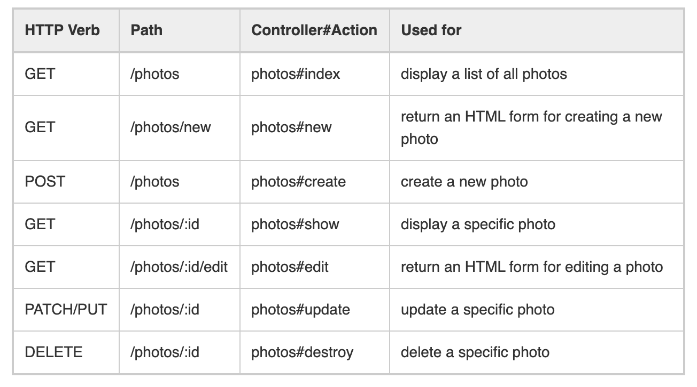

# Rails Restful Routes and CRUD Actions

## Overview
- Rails follows a RESTful pattern for interaction between the client and the server
- Rails has conventions for accessing and manipulating the information going to and coming from the database of the application

## Learning Objectives
- Understanding the Rails convention for creating routes and controller methods
- Understanding the anatomy of a rails route
- Understanding the roll of controller methods and routes in creating full CRUD capability
- Further exploring Rails conventions and Rails "magic"

## Vocabulary
- CRUD
- HTTP Verbs
- RESTful routing
- index
- show

## Useful Terminal Commands
- `rails routes` - shows all the route options for any rails model

## Additional Resources
- <a href="https://guides.rubyonrails.org/routing.html" target="blank">Rails Routing from the Outside In</a>
- <a href="./Rails-C&V/00rails_http_intro.md" target="blank">RESTful Web Application Framework</a>

#### Creating a new Rails app:
```
rails new myapp -d postgresql -T
cd myapp
rails db:create
rails server
```
In a browser navigate to:
`http://localhost:3000`
or
`127.0.0.1:3000`

### RESTful Routes
- REST stands for Representational State Transfer
- REST is a pattern to follow when structuring routes between the server and the client
- RESTful routes are an attempt to bring the operations that can be applied to an object into HTTP requests
- Creating, Reading, Updating, and Deleting will accomplish almost all the tasks needed to do to an object creating a standard language and structure across all of the objects in our application

Examples of routes for a model called `Photo` and a controller called `photos_controller`:


### Anatomy of a Rails Route
Rails routes follow two basic structures:
- Routes without params
```ruby
get '/photos' => 'photos#index'
```
  - `get` is the http verb
  - `/photos` is url request
  - `photos#` is the name of the controller
  - `index` is the name of the controller method

- Routes with params
```ruby
delete '/photos/:id' => 'photos#destroy'
```
  - `delete` is the http verb
  - `/photos/:id` is url request
  - `/:id` is the params to be passed to the url
  - `photos#` is the name of the controller
  - `destroy` is the name of the controller method

### Rails Controller Methods and RESTful Routes

#### Index
- The controller method **index** represents the **R** in CRUD and is the Rails convention for listing all the items in a particular model, or `show all`
- The HTTP verb associated with index is **get**
- The index route is: `get '/resource_names' => 'resource_name#index'`

#### Show
- The controller method **show** represents the **R** in CRUD and is the Rails convention for listing one item in a particular model, or `show one`
- The HTTP verb associated with index is **get**
- The show route is: `get '/resource_names/:id' => 'resource_name#show'`

#### New
- The controller method **new** represents a midway point between **C** and **R** in CRUD and is the Rails convention for the route that displays a form to the user
- The HTTP verb associated with new is **get**
- The new route is: `get '/resource_names/new' => 'resource_name#new'`

#### Create
- The controller method **create** represents the **C** in CRUD and is the Rails convention for adding information to the database
- The HTTP verb associated with create is **post**
- The create route is: `post '/resource_names' => 'resource_name#create'`

#### Update
- The controller method **update** represents the **U** in CRUD and is the Rails convention for modifying information in the database
- The HTTP verb associated with update is **put/patch**
- The update route is: `put/patch '/resource_names/:id' => 'resource_name#update'`

#### Delete
- The controller method **delete** represents the **D** in CRUD and is the Rails convention for removing information from the database
- The HTTP verb associated with delete is **delete** (shocking right?)
- The delete route is: `delete '/resource_names/:id' => 'resource_name#destroy'`

## Linking Between Routes

#### link_to
- A Ruby method used in the Rails **view**
- Takes two arguments:
  - the anchor (what will become the hyperlink)
  - the url path

#### as:
- A Rails has a helper method that can be added to the end of each **route** to make the process of linking pages in the view easier and faster
- The name given to the helper method is referenced in the second argument of `link_to` by adding `_path` to the end
- If the route requires a param, the helper method path will require an argument

```ruby
get '/resource_name' => 'resource_name#index', as: 'all_resource_names'
get '/resource_name/:id' => 'resource_name#show', as: 'resource_name'
```
```ruby
# helper method without param/argument
<%= link_to "List Everything", all_resource_names_path %>
```
```ruby
# helper method with param/argument
<%= link_to "Show One Thing", resource_name_path(id) %>
```

## Review
- CRUD is an acronym describing the minimal actions necessary for a full stack web application
- The RESTful protocol is a pattern followed by developers to implement CRUD operations
- Rails *Convention Over Configuration* gives us strict guidelines for controller methods and routes

[Back to Syllabus](../README.md)
