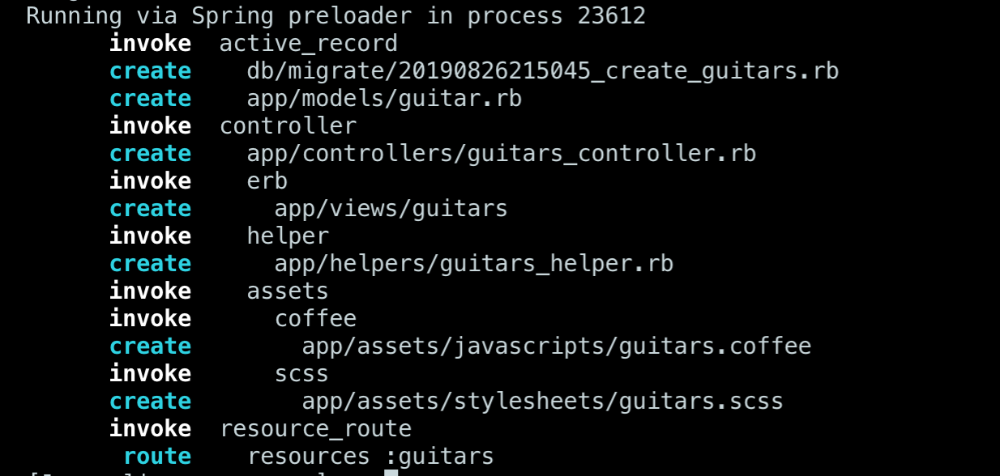

# Generating a Resource in Rails

We have covered some of the Rails generator commands. As we've seen, generators can save us a lot of time by setting up the files we need in order to say start coding up a response to a server request or to create and connect a model to a table in a database. One of the most useful ones is the resource generator.

Let's have a look at what the resource generator provides for us.

## Creating the app

Here we're gonna create a simple app for tracking different types of guitars.

I've created an app using the usual setup:

```bash
rails new guitar-tracker -T --database=postgresql
rails db:create
```

I happen to know that I want to I want full CRUD functionality for the guitar model. I want to be able to **C**reate **R**ead **U**pdate **D**elete any guitar record I want. This is where the resource generator comes in handy.

I'm going to generate my guitar resource with this command:

```bash
rails generate resource Guitar strings:integer manufacturer:string model:string color:string
```

Rails does some work for me and I receive this output:



With that one command, Rails just about everything I need to start working with guitars as a data resource.

It set up both the migration and model that I need to start using guitars as an ActiveRecord class. It created a controller (and a guitar views folder) so that I can start coding up some controller actions. And finally, it plugged in resourced routes for my guitars.

I can use this handy command to see what that `resources :guitars` line does:

```bash
rails routes
```

There's a lot that's output to the screen but lets focus on this section:

