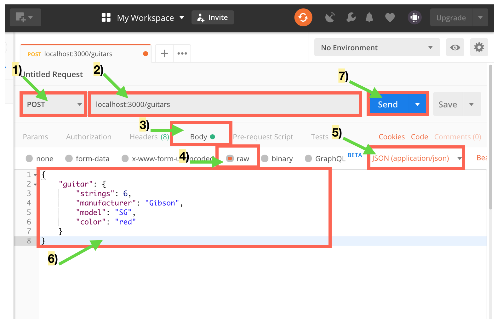
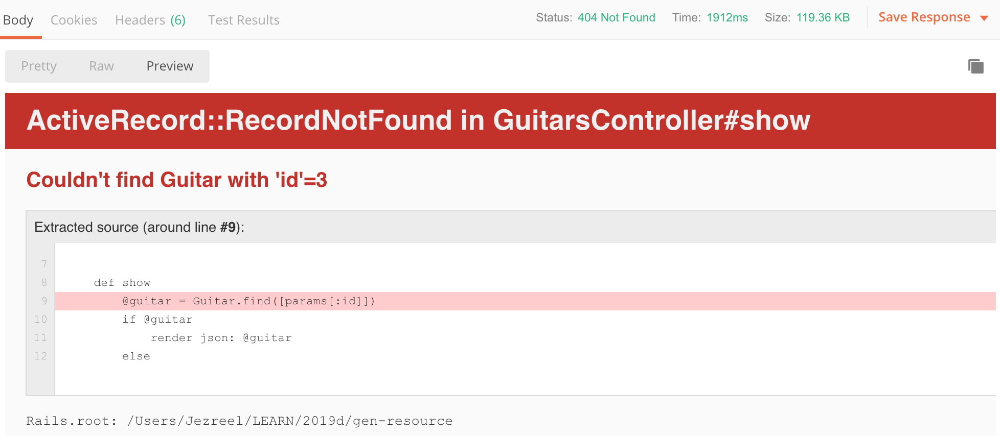

# Generating a Resource in Rails Cont.

To round out our knowledge on the development flow using a rails generated resource we'll cover 2 more CRUD actions: Create and Delete.

For this section we'll be using Postman to interact with our JSON API. Here's some resource material on Postman to get you started: [Postman Resource](../tools_and_resources/postman.md)

## Coding a create response

First we'll tackle building the method to create a guitar.

We'll update `guitars_controller.rb` like so:

```ruby
class GuitarsController < ApplicationController

    #...index/show methods...

    def create
        @guitar = Guitar.new(guitar_params)
        if @guitar.save
            render json: @guitar, status: 201
        else
            render json: @guitar.errors, status: 422
        end
    end

    private

    def guitar_params
        params.require(:guitar).permit(:strings, :manufacturer, :model, :color)
    end
end
```

Now we've set up strong params for our controller and we have added a method to create a guitar or render errors.

Let's try out our new endpoint through Postman.

We'll set up our request like so (from our [Postman resource](../tools_and_resources/postman.md)):



When we click send, given that we've formatted our request correctly, we should see a response like this:


Notice that we get a **Status: 200 OK** and we get the newly created guitar in the body of our response.

##  Coding a destroy response

The destroy action is the conventional Rails action for implementing the **D**elete operation. Let's build out that action.

We'll add a destroy method to our `guitars_controller.rb`:

```ruby
def destroy
    @guitar = Guitar.find(params[:id])
    if @guitar && @guitar.destroy
        render json: @guitar, status: 200
    else
        render json: { errors: "Could not destroy guitar " }, status: 400
    end
end
```

Once that's set up, we'll recall our routes or run `rails routes` in my terminal:


We see that our delete action is mapped to `/guitars/:id` so that's what we'll attempt to reach in Postman. Let's try to delete the guitar we just created.

We'll build our request like so:


Notice that we've selected the `DELETE` verb and set up the url with the `id` of the guitar we want delete.

When we hit send, we should get back the item we just deleted:


Now if we try to show the guitar we just deleted, we should receive an error:



The only CRUD action left is the **U**pdate, but leave that up to you to put together.