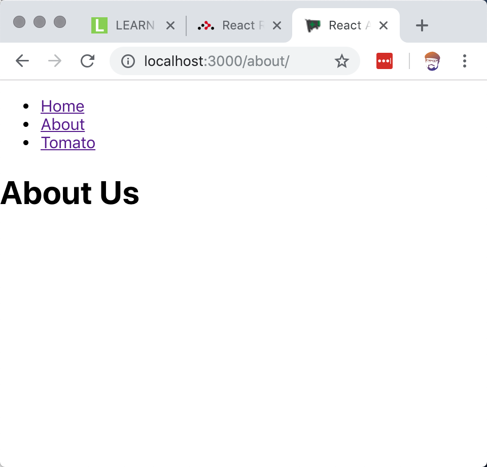
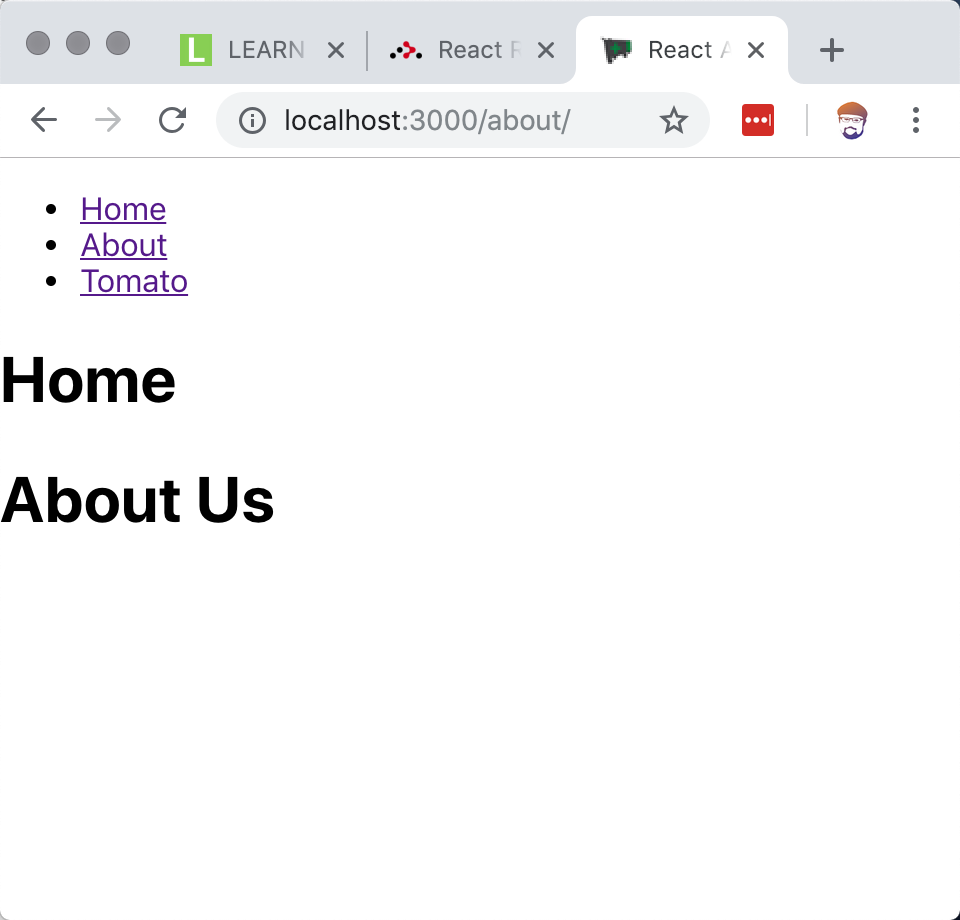

# Adding pages to a React Application

[](https://www.youtube.com/watch?v=GqNurNBKPAw)

Up until this point, we've worked with React apps that only have one page, and most of the code we've written all went in App.js.  Now we'd like to have an app that has a few different pages of content.  Even for a very basic website, we'd like to have a home page, an 'about us' page, and a few detail pages holding content for whatever our site is about.

We could create all of those pages in one file, but it would get hard to manage pretty quickly.  Instead, we want to keep each page level component in its own file, import them into App.js, and then use a router to load and unload them based on user actions.  First, lets look at a decent structure for our applicaiton.  Note that there are no hard and fast rules for structure in a React App, but simplier is better, so we'll start as simple as we can.

## React Project Structure
```result
src
├── App.css
├── App.js
├── index.css
├── index.js
├── pages   <-- This is the directory we've added
│   ├── AboutUs.js
│   ├── Home.js
│   └── Tomato.js
└── serviceWorker.js
```

You can see from above that we've added a "pages" directory to hold each of the pages we're about to create.  Each file in "pages" is a React component that we'll import into "App.js" and use in our router.

Here's the code for the Home component.
```javascript
import React, { Component } from 'react'
import ReactDOM from 'react-dom'

class Tomato extends Component {
  render() {
    return(
      <h1>Tomato</h1>
    )
  }
}
export default Tomato
```

The other two are pretty similar.  You can check them all out in the sample project.

* [AboutUs](./heirloom-tomatoes/src/pages/AboutUs.js)
* [Home](./heirloom-tomatoes/src/pages/Home.js)
* [Tomato](./heirloom-tomatoes/src/pages/Tomato.js)


## React Router


Ready to see how we can navigate to these pages?  Great, let's do it.

To do page routing in React, we need to add a new npm package to our app called react-router-com

```bash
yarn add react-router-dom
```
Here's the completed App.js.  We're going to look at this file in a lot closer detail next:

```bash
cat src/App.js
```
```javascript
import React, { Component } from "react";
import ReactDOM from 'react-dom'
import {
  BrowserRouter as Router,
  Route,
  Link
} from "react-router-dom";

//Pages
import AboutUs from './pages/AboutUs'
import Home from './pages/Home'
import Tomato from './pages/Tomato'

class App extends Component {
  render() {
    return(
      <Router>
        <div>
          <nav>
            <ul>
              <li>
                <Link to="/">Home</Link>
              </li>
              <li>
                <Link to="/about/">About</Link>
              </li>
              <li>
                <Link to="/tomato/">Tomato</Link>
              </li>
            </ul>
          </nav>

          <Route path="/" exact component={Home} />
          <Route path="/about/" component={AboutUs} />
          <Route path="/tomato/" component={Tomato} />
        </div>
      </Router>
    )
  }
}

export default App
```

### Imports

Have a look at what we're importing into App.js

```javascript
1	import React, { Component } from "react";
2	import ReactDOM from 'react-dom'
3	import {
4	  BrowserRouter as Router,
5	  Route,
6	  Link
7	} from "react-router-dom"; //<-- These are all components from the router that we use in render().
8
9	//Pages
10	//Here are our pages.  They get imported, and then
11	//rendered as part of the component structure
12	//of App's render function.
13	import AboutUs from './pages/AboutUs'
14	import Home from './pages/Home'
15	import Tomato from './pages/Tomato'
```

* Line: 4 - We import BrowserRouter because we are routing between web pages rendered in a browser.  There's also NativeRouter for building IOS and Android React applications.
* Line: 5 - ReactRouter is declarative, or dynamic routing.  That means we declare them using components, just like the rest of React.
* Line: 6 - Finally, from the react-router-dom package, we use the Link component.  This is to create links for our users to click on.
* Lines: 13 - 15 - Here are our individual page components.  They get rendered the same as any other component inside of the router, which makes routing feel very "React like" which is much appreciated.

### Rendering the Router
Next lets take a look at how to render the Router, and embedded Routes within it.  Here's a simplified (psuedo-code) version of App.js above:

```html
render() {
  return(
    <Router>
      <div>
        <non-router related code />
        <Route ... />
        <Route ... />
        <Route ... />
      </div>
    </Router>
  )
```

Think back to the work we did with Rails, and Layouts, and this code may feel somewhat familiar.  Outermost, we have the Router, and then we have a lot of HTML tags (```<non-router related code />``` in this example) that are part of every page (just like a layout in Rails), regardless of what route is currently active. Finally, we have a list of routes.  Conceptually, you can think of whatever route is active based on the browser URL as being swapped out with the spcified page component, and the rest are ignored.

### What is a Route?
Here are the 3 routes in our sample project

```html
36 <Route path="/" exact component={Home} />
37 <Route path="/about/" component={AboutUs} />
38 <Route path="/tomato/" component={Tomato} />
```

At their most basic, routes have a path, and a component prop.  The path specifies a matcher for the browsers URL, and the component prop specifies the component to render when there is a match.

#### exact
Notice the exact prop on line 36.  That is required on the home route because in ReactRouter, more than one route can match at any given time.  For example, here's what our sample app looks like with the routes above when we go to the AboutUs page:



If we change the route on 36 so they are now:

```html
<Route path="/" component={Home} />
<Route path="/about/" component={AboutUs} />
<Route path="/tomato/" component={Tomato} />
```

Then the page changes to look like this:  Not What We Want!



Notice that both the Home and the AboutUs route are rendering.  Both routes match, so both render!  We can prevent this by adding the ```exact``` prop.

### Switch
We can also use the Switch component to match only one route.  With switch, the first route matches, so we'll have to rearrange our routes to have the least specific ("/") after the more specific ones.

* Note: the following works after adding "Switch" to our import statements at the top of the file.

```html
37 <Switch>
38   <Route path="/about/" component={AboutUs} />
39   <Route path="/tomato/" component={Tomato} />
40   <Route path="/" exact component={Home} />
41 </Switch>
```

### No Match (404)
When using Switch, we can also specify a default route that always matches last by creating a Route that has no path.  That way, we're sure to at least show the user something.  This route will match when the user goes to an URL that is not found.

Here is our NotFound component
```
1	import React, { Component } from 'react'
2	import ReactDOM from 'react-dom'
3
4	class NotFound extends Component {
5	  render() {
6	    return(
7	      <h1>Not Found</h1>
8	    )
9	  }
10	}
11
12	export default NotFound
```

And after Importing it at the top of App.js, we can add a Route for it:

```html
38	          <Switch>
39	            <Route path="/about/" component={AboutUs} />
40	            <Route path="/tomato/" component={Tomato} />
41	            <Route path="/" exact component={Home} />
42	            <Route component={NotFound} />
43	          </Switch>
```

Now going to any URL except for the ones listed in our Routes will show the user our Not Found page.

### More to discover
There are a lot more advanced features to the React Router than we've covered here.  If you get stuck, or want to explore more of what you can do with ReactRouter, [head over to their docs](https://reacttraining.com/react-router/web/guides/quick-start)
