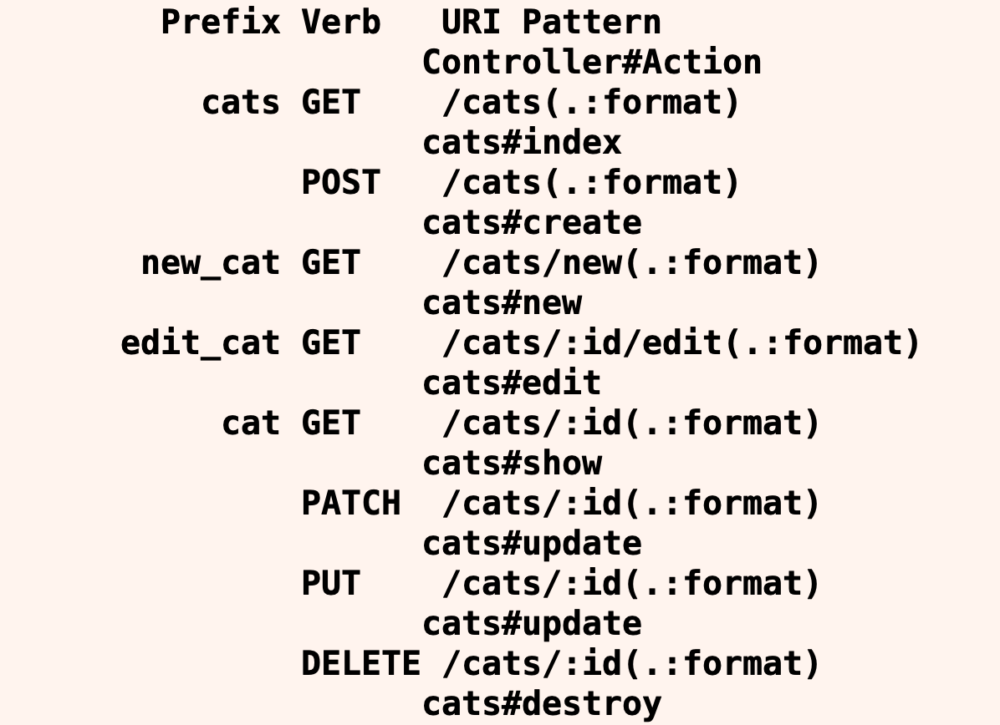

# Cat Tinder API Endpoints

## Overview
- Endpoints are the location from which APIs can access the resources they need to perform CRUD actions.
- Endpoints can be tested through request specs and model specs.

## Learning Objectives
- Implementing request specs in a Rails application
- Implementing model specs in a Rails application
- Implementing appropriate endpoints in the cats controller

## Cats Routes



We need to create endpoints for the actions in our React application. For the time being we can stub these routes.

**app/controllers/cats_controller.rb**
```ruby
class CatsController < ApplicationController

  def index
  end

  def show
  end

  def create
  end

  def update
  end

  def destroy
  end

end
```

## Index Route
We start with the index route. In this endpoint, we want to return all of the cats that the application knows about.

**Create a Spec**  
We're going to practice Test Driven Development, so let's start with a test. We'll add our test to the `cats_request_spec.rb` file:

**/spec/requests/cats_request_spec.rb**
```ruby
require 'rails_helper'

describe "Cats", type: :request do
  it "gets a list of Cats" do
    # Create a new cat in the Test Database (this is not the same one as development)
    Cat.create(name: 'Felix', age: 2, enjoys: 'Walks in the park')

    # Make a request to the API
    get '/cats'

    # Convert the response into a Ruby Hash
    json = JSON.parse(response.body)

    # Assure that we got a successful response
    expect(response).to have_http_status(:ok)

    # Assure that we got one result back as expected
    expect(json.length).to eq 1
  end
end
```

When we run that spec, it fails of course, because we don't have any code in the controller to respond to the request correctly. Yay failure!

Now we can write the controller code to make it pass:

```ruby
def index
  cats = Cat.all
  render json: cats
end
```

## Show Route
Now we can make sure the show route is working correctly.

**Create a Spec**  
We're going to practice Test Driven Development, so let's start with a test. We'll add our test to the `cats_request_spec.rb` file:

**/spec/requests/cats_request_spec.rb**
```ruby
it "gets one Cats" do
  # Create a new cat in the Test Database (not the same one as development)
  cat = Cat.create(name: 'Felix', age: 2, enjoys: 'Walks in the park')

  # Make a request to the API
  get "/cats/#{cat.id}"

  # Convert the response into a Ruby Hash
  json = JSON.parse(response.body)

  # Assure that we got a successful response
  expect(response).to have_http_status(:ok)

  # Assure that we got one result back as expected
  expect(cat.name).to eq 'Felix'
end
```

When we run that spec, it fails of course, because we don't have any code in the controller to respond to the request correctly. Yay failure!

Now we can write the controller code to make it pass:

```ruby
def show
  cat = Cat.find(params[:id])
  render json: cat
end
```

## Create
Next we'll tackle the 'create' route.  Let's start with adding a new test:

```ruby
  it "creates a cat" do
    # The params we are going to send with the request
    cat_params = {
      cat: {
        name: 'Buster',
        age: 4,
        enjoys: 'Meow Mix, and plenty of sunshine.'
      }
    }

    # Send the request to the server
    post '/cats', params: cat_params

    # Assure that we get a success back
    expect(response).to have_http_status(:ok)

    # Look up the cat we expect to be created in the Database
    cat = Cat.first

    # Assure that the created cat has the correct attributes
    expect(cat.name).to eq 'Buster'
  end
```

And once again, this fails because we have no code in the controller to make it pass. Good! Adding the controller code for this spec is as follows:

```ruby
  def create
    # Create a new cat
    cat = Cat.create(cat_params)

    # respond with our new cat
    render json: cat
  end

  # Handle strong parameters, so we are secure
  private
  def cat_params
    params.require(:cat).permit(:name, :age, :enjoys)
  end
```

And we're Green! This isn't quite production ready code, but its enough to get our first test of the endpoint to pass, which is what we're after, so we're happy.  


## Challenge: Cat Tinder API Endpoints
As a developer, I have been commissioned to create an application where a user can see cute cats looking for friends. As a user, I can see a list of cats. I can click on a cat and see more information about that cat. I can also add cats to the list of cats looking for friends. If my work is acceptable to my client, I may also be asked to add the ability to remove a cat from the list as well as edit cat information.

- As a developer, I can add an index request spec to my application
- As a developer, I can add an index endpoint to my application
- As a developer, I can add a show request spec to my application
- As a developer, I can add a show endpoint to my application
- As a developer, I can add a create request spec to my application
- As a developer, I can add a create endpoint to my application
- As a developer, I can add a update endpoint to my application
- As a developer, I can add a destroy endpoint to my application


[ Go to next lesson: Cat Tinder API Validations ](./validations.md)

[ Back to Cat Tinder API Seeds ](./seeds.md)

[ Back to Syllabus ](../../README.md)
