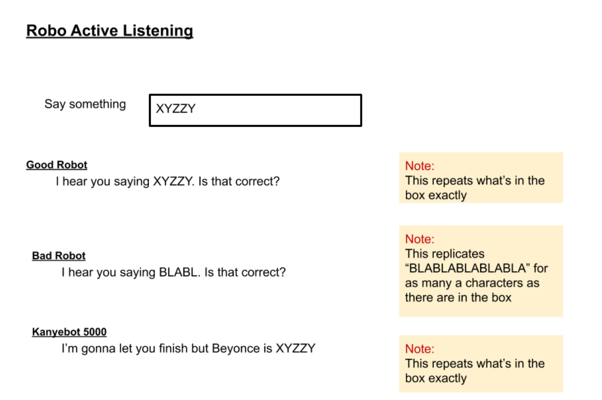
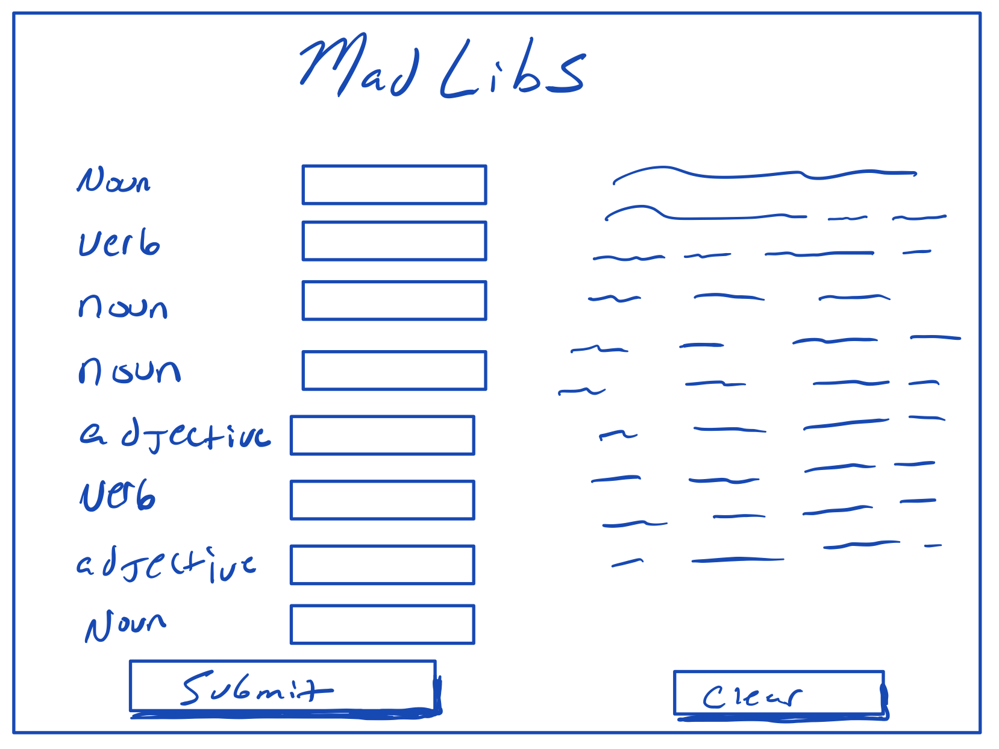

# React Forms

## Previous Lecture
[](https://www.youtube.com/watch?v=vBpjxASFhPo)


- Adding a form to a component that will update state


- Adding input fields
- Creating a method to handle DOM event changes (what the user types)
- Creating a method to set state with the user input


## Vocabulary
- state
- props
- input, value, onChange
- dumb/display component
- smart/logic component
- DOM event, often shortened to `e`

#### Creating a new React app:
```
yarn create react-app myApp
cd myApp
yarn start
```

## Step 1
Let's take a closer look at the difference between component state and props by adding an input element to the page.

We'll create a smart component that holds state and passes information to a child component called `Greeter`.

**src/App.js**
```javascript
import React, { Component } from 'react'
// importing the Greeter component
import Greeter from './components/Greeter'

class App extends Component{
  constructor(props){
    super(props)
    // creating a state object that contains a key of "name" and a value of "Bob"
    this.state = {
      name: "Bob"
    }
  }

  render(){
    return(
      <div>
        {/* <Greeter /> is getting passed the information from the state object as props called "name" */}
        <Greeter
          name={ this.state.name }
        />
      </div>
    )
  }
}
export default App
```

## Step 2
Now the child component `Greeter` will display the name value passed as props from the parent component. This component is `display or dumb`. It accepts a greeting in props, and displays it.

**src/components/Greeter.js**
```javascript
import React, { Component } from 'react'

// Greeter is a dumb/display component that does not hold state
class Greeter extends Component {
  render() {
    // We are passing the state object value as props called "name" <name={ this.state.name }> from the parent App.js
    return (
      <h1>Hello, { this.props.name }! </h1>
    )
  }
}

export default Greeter
```

## Alternative Dumb Component
**src/components/Greeter.js**
```javascript
import React from 'react'

// Greeter is a dumb/display component that does not hold state
 const Greeter = (props) => {
    // We are passing the state object value as props called "name" <name={ this.state.name }> from the parent App.js
    return (
      <h1>Hello, { props.name }! </h1>
    )
}

export default Greeter
```
In the browser we will see: `Hello, Bob!`

## Step 3
To increase the functionality of our app, let's add a way for our user to enter their name rather than having a hardcoded name in state. To do this we need a text input and a method that will update state as our user types in the input.

**src/App.js**
```javascript
import React, { Component } from 'react'
// importing the Greeter component
import Greeter from './components/Greeter'

class App extends Component{
  constructor(props){
    super(props)
    // changing the state object to hold an empty string
    this.state = {
      name: ""
    }
  }

  handleChange = (event) => {
    // a method that will take the value from an input and save it in the state key "name"
    this.setState({ name: event.target.value })
  }

  render() {
    return (
      <div>
        {/* adding a JSX tag <input /> that will call the handleChange method and pass the value of the state object */}
        <input
          value={ this.state.name }
          onChange={ this.handleChange }
        />
        {/* same information being passed as props to <Greeter /> */}
        <Greeter
          name={ this.state.name }
        />
      </div>
    )
  }
}
export default App
```
In our example, the JSX input tag takes two attributes:
  - `value` of our state object
  - `onChange` that calls a method called handleChange that will collect the information entered in the input and update state!

**Notice** that for the input, we need both a `value` and `onChange`. `<input>` has its own internal state, so we need to use the props `value` and `onChange` to pass the proper context into it. The input is re-rendered every time the state of the component changes.

The information from the input is passed to the child `Greeter` component.

## Step 4
We can change the user output by adding a method in the `Greeter` component.

**src/components/Greeter.js**
```javascript
import React, { Component } from 'react'

class Greeter extends Component {
  // Greeter is a dumb/display component that does not hold state

  capitalizer = (userInput) => {
    // a display component can have its own methods that act on the information being passed as props
    return userInput.toUpperCase()
  }

  render() {
    return (
      // calling a method and passing the information from the input
      <h1>Hello, { this.capitalizer(this.props.name) }! </h1>
    )
  }
}

export default Greeter
```
## Alternate Smart Component (passing methods to dumb components)
**src/App.js**
```javascript
import React, { Component } from 'react'
// importing the Greeter component
import Greeter from './components/Greeter'

class App extends Component{
    constructor(props){
      super(props)
      // changing the state object to hold an empty string
      this.state = {
        name: ""
      }
    }

    handleChange = (event) => {
      // a method that will take the value from an input and save it in the state key "name"
      this.setState({ name: event.target.value })
    }

    capitalizer = (userInput) => {
        // a display component can have its own methods that act on the information being passed as props
        return userInput.toUpperCase()
      }

    render() {
      return (
        <div>
          {/* adding a JSX tag <input /> that will call the handleChange method and pass the value of the state object */}
          <input
            value={ this.state.name }
            onChange={ this.handleChange }
          />
          {/* same information being passed as props to <Greeter /> */}
          <Greeter
            name={ this.state.name } capitalizer={this.capitalizer}
          />
        </div>
      )
    }
  }
  export default App
  ```

## Alternate dumb component (using inherited methods)
**src/components/Greeter.js**
```javascript
import React from 'react'

const Greeter = (props) => {
  // Greeter is a dumb/display component that does not hold state

    return (
      // calling a method and passing the information from the input
      <h1>Hello, { props.capitalizer(props.name) }! </h1>
    )
}

export default Greeter
```

## Step 5

As our app grows, we'll likely want to move the `<input />` into its own component.

**src/App.js**
```javascript
import React, { Component } from 'react'
// importing the Greeter component
import Greeter from './components/Greeter'
// importing the NameInput component that we are about to create
import NameInput from './components/NameInput'

class App extends Component{
  constructor(props){
    super(props)
    // state object stays the same
    this.state = {
      name: ""
    }
  }

  updateName = (name) => {
    // this method is passed as props to <NameInput /> so the value from the child component can be passed back "up river" to the parent App.js
    this.setState({ name: name })
  }

  render() {
    return (
      <div>
        {/* <Greeter /> gets the same information as props */}
        <Greeter
          name={ this.state.name }
        />
        {/* <NameInput /> gets the information from state and a method as props  */}
        <NameInput
          name={ this.state.name }
          updateName={ this.updateName }
        />
      </div>
    )
  }
}

export default App
```

## Step 6
Let's create a new child component called `NameInput` and move the input into this component. We need to refactor the `value` attribute and create a new `handleChange` method for this component.

**src/components/NameInput.js**
```javascript
import React, { Component } from 'react'

class NameInput extends Component {
  // NameInput is a dumb/display component that does not hold state

  handleChange = (event) => {
    // method that takes the value from the input and calls updateName
    this.props.updateName(event.target.value)
  }

  render() {
    // the JSX tag <input /> has the value of name coming as props from App.js
    return (
      <input
        value={ this.props.name }
        onChange={ this.handleChange }
      />
    )
  }
}

export default NameInput
```

## Challenges

### 1) Listening Robot

#### User Stories

- As a user, I see a page with a text input.
- As a user, I see titles of three robots waiting for my text.
- As a user, when I enter text I see the robots responses update in real time.

### Developer Stories

- As a developer, I have one parent component that holds state (logic or smart component).
- As a developer, I have three child components that do not hold state (display or dumb component).
- As a developer, I have an input in my parent component.
- As a developer, I can call an onChange method in the input tag.
- As a developer, I can create a handleChange method that will update state in my parent component.
- As a developer, I can pass the updated state as props to the child components.
- As a developer, I can see the child components display the user input.
- As a developer, I can create modification to the user input text by creating a method in my child component.



## Submit
When submitting a form, you need to handle the submit functionality. This is where we use a function that we are going to call `handleFormSubmit`.

When handling a form submit, we need to prevent the default action from happening. Because, when a form is typically submitted, it will send the information wherever it needs to go and then refresh the page. We don't want the page to refresh, because then we will lose all of our data because the data, currently, does not persist (it is not stored anywhere).

We want to stop those default actions from happening, so we use `event.preventDefault()` to take care of that for us. Here is an example of what that looks like:

```javascript
handleFormSubmit = event => {
  event.preventDefault();
  //whatever we want the form to do
}
```

This code will prevent the form from submitting the form AND from refreshing the page. Make sure you add the necessary code AFTER the .preventDefault() method so that your form actually does something.

## 2) Mad Libs

#### User Stories
- As a user, I can see a page with many text inputs.
- As a user, I can see labels next to the text inputs indicating what part of speech (or type of word) should be entered into each text form: nouns, pronouns, verbs, adjectives, and adjectives.
- As a user, I can fill out the inputs.
- As a user, after I have filled out the text inputs I can click a 'Submit' button.
- As a user, when I click 'Submit' I see a paragraph appear on the page that contains the words I entered in the text forms to create a funny story.
- As a user, I can click a 'Clear' button that removes the story and the text inputs and returns the page to the original state.




[Go to next lesson: Intro to Ruby](../ruby/intro.md)

[Back to React State and Props](./state-and-props.md)

[Back to Syllabus](../README.md)
