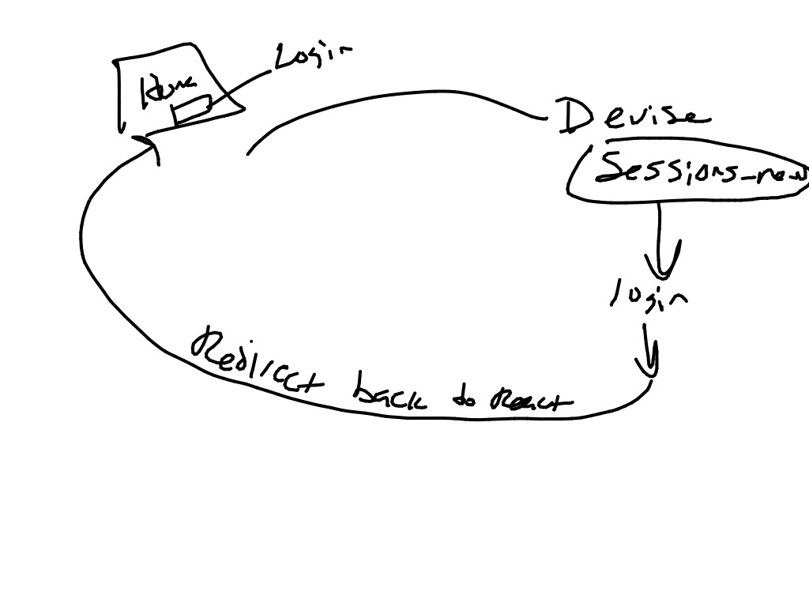

# Devise and React IN Rails
WIP
## Video: Devise and React
[](https://www.youtube.com/watch?v=96Kd2dCsXm8)

[](https://www.youtube.com/watch?v=qHC8NEDlB8U)

## Overview
This example combines what we've learned about Devise with what we've learned about React to build a React application that offloads authentication responsibilities to Devise.


## Learning Objectives



### Set Up Devise
- $ rails new devise_and_react_app -d postgresql -T
- $ cd devise_and_react_app
- $ bundle add devise
- $ rails generate devise:install
- $ rails generate devise User
- $ rails db:create
- $ rails db:migrate


## Add React
- $ bundle add react-rails
- $ rails webpacker:install
- $ rails webpacker:install:react
- $ rails generate react:install


### Generate a New React Component
- $ rails g react:component App


### Add a Homepage
- $ rails g controller Home
- ?? Add index here?
### Add a Route to the Homepage
**config/routes.rb**
```ruby
Rails.application.routes.draw do
  devise_for :users
  get '*path', to: 'home#index', constraints: ->(request){ request.format.html? }
  root to: 'home#index'
end
```
This route directs all HTML traffic to the 'home#index' route, but ignores non HTML traffic, like our API requests will be.  That is perfect to interact with the React router eventually if and when that gets added to your app.

### Add a Homepage and React Component
Next, we'll add a homepage view, and add our react component to it.  We want to pass three pieces of information down from Rails into our React App.
1) If user is logged in or not
2) Relative URL of login screen (from Devise)
3) Relative URL of logout endpoint (also from Devise)

**app/views/home/index.html.erb**
```
<%= react_component("App", {
    logged_in: user_signed_in?,
    sign_in_route: new_user_session_path,
    sign_out_route: destroy_user_session_path
}) %>
```

### Login/Logout Button
With login status and routes in our React component, we can now add a button to log the user out or in.

First we need to instruct Devise to listen for logout requests via GET instead of the default DELETE.  We do that in Devise's config file:

**config/initializers/devise.rb**
```ruby
# Find this line:
config.sign_out_via = :delete
# and replace it with this:
config.sign_out_via = :get
```

This example puts the button in App.  You may choose to pass those props to another component, and place the buttons there.


**app/javascript/components/App.js**
```javascript
import React from "react"
import PropTypes from "prop-types"

class App extends React.Component {
  render () {
    const {
      logged_in,
      sign_in_route,
      sign_out_route
    } = this.props

    return (
      <React.Fragment>
        {logged_in &&
          <div>
            <a href={sign_out_route}>Sign Out</a>
          </div>
        }
        {!logged_in &&
          <div>
            <a href={sign_in_route}>Sign In</a>
          </div>
        }
      </React.Fragment>
    );
  }
}

export default App
```

[ Go to next lesson: Apartment App Challenge ](./apartment_app.md)

[ Back to Devise Introduction ](./devise.md)

[ Back to Syllabus ](../README.md#unit-nine-react-in-rails-and-authentication)
